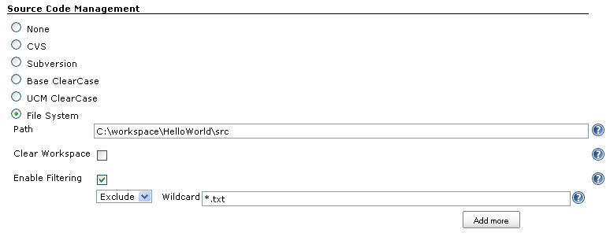

[![][ButlerImage]][homepage]

# About
This is the source repository for the **File System SCM** plugin for Jenkins.
This plugin provides an additional SCM option to Jenkins, based on the file
system.

For more information see the [homepage].

# Purpose and Use Cases

Use this plugin if you want to use the Jenkins SCM (source code management)
functionality, but instead of retrieving code from a version control system such
as CVS, Subversion or git, instead retrieve the code from a directory on the
file system.

A typical use case is: during development of a Jenkins job (e.g. a pipeline),
you don't need/want to connect to an actual version control system, but avoid
the latency by just getting things from the local file system.

# How to Raise Issues

If you find any bug, or if you want to file a change request, then please
check out:
[How to report an issue](https://wiki.jenkins.io/display/JENKINS/How+to+report+an+issue).

When creating a ticket in the [Jenkins JIRA](https://issues.jenkins-ci.org/)
system, select the component `filesystem_scm_plugin`.

# Source
The source code can be found on
[GitHub](https://github.com/jenkinsci/filesystem_scm-plugin). Fork us!

# Contributing

Contributions are welcome! Check out the
[open tickets](https://issues.jenkins-ci.org/issues/?jql=project%20%3D%20JENKINS%20AND%20status%20in%20%28Open%2C%20Reopened%29%20AND%20component%20%3D%20filesystem_scm-plugin)
for this plugin in JIRA.

If you are a newbie, and want to pick up an easier task first, you may
want to start with
[newbie-friendly open tickets](https://issues.jenkins-ci.org/issues/?jql=project%20%3D%20JENKINS%20AND%20status%20in%20%28Open%2C%20Reopened%29%20AND%20component%20%3D%20filesystem_scm-plugin%20AND%20labels%20%3D%20newbie-friendly)
first (if there are any).

# License
This Jenkins plugin is licensed under the [MIT License](./LICENSE.txt).

[ButlerImage]: https://jenkins.io/sites/default/files/jenkins_logo.png
[homepage]: https://plugins.jenkins.io/filesystem_scm

Use File System as SCM.

Simulate File System as SCM by checking file system last modified date,
checkout(), pollChanges(), ChangeLog and distributed build are all
supported.

Folder difference is found by

1.  for each file in source, check if the corresponding file in
    workspace exists
    1.  if not, it is a new file
    2.  if yes, further checks if the file in source is newer than file
        in workspace, or if source file is modified since last build,
        this is a modified file
2.  for each file in workspace, if the corresponding file in source does
    not exist AND
    1.  it is in our self maintained "allow delete list", we will delete
        this file from workspace. Every times we copy a file from src to
        dst, we add the filename to the "allow delete list", in other
        words, we will only delete files that are copied by us

Filtering is supported when checking for modified files.

If ***Clear Workspace*** is checked, the system will delete all existing
files/sub-folders in workspace before checking-out. Poll changes will
not be affected by this setting.

In Changelog, ***User***, i.e. who changed the file, is not supported.

## Report Bugs

https://www.jenkins.io/participate/report-issue/redirect/#15698/filesystem_scm
